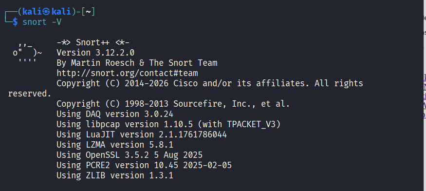
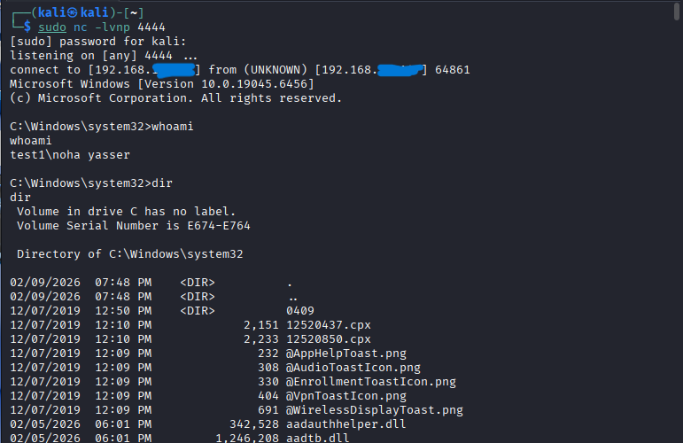
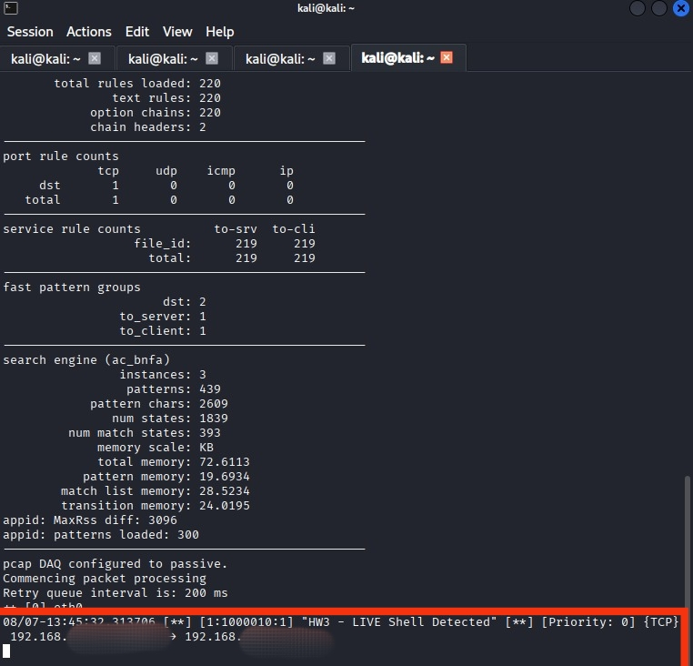

# Snort-3-Reverse-Shell-Detection
This project focuses on detecting suspicious reverse shell activity using Snort 3 in a controlled virtual lab environment.  The main goal was not only to generate an alert, but to understand how a SOC Analyst can design a focused network detection that provides meaningful and actionable security information.

## Lab Environment

- Kali Linux – Attacker / IDS Sensor
- Windows 10 – Target
- Snort 3.12.2.0
- TCP-based network communication
- Custom Snort detection rule
- Isolated virtual lab environment

## Detection Approach

The detection was designed around several key concepts:

### 1. Traffic Direction

The rule specifies the expected traffic direction between the external and internal networks.

This helps Snort focus on relevant traffic instead of inspecting unrelated connections.

### 2. TCP Session State

The rule uses:

`flow:to_server,established`

This limits inspection to established TCP sessions and avoids triggering on initial connection packets such as SYN/ACK traffic.

### 3. Content Matching

The rule uses a specific content indicator:

`content:"whoami"`

This provides a focused detection anchor based on the command executed during the controlled test.

### 4. Reducing False Positives

A detection rule should not simply generate as many alerts as possible.

Using multiple conditions such as protocol, destination port, traffic direction, session state, and specific content helps increase detection precision and reduce unnecessary alerts.

## Custom Rule

```snort
alert tcp $EXTERNAL_NET any -> $HOME_NET 4444 (
    msg:"HW3 - LIVE Shell Detected";
    flow:to_server,established;
    content:"whoami";
    sid:1000010;
    rev:1;
)
## SOC Analyst Perspective

From a SOC Analyst perspective, detecting suspicious network activity is only the beginning of the investigation.

An IDS alert provides an initial indicator, but the analyst needs to validate the event and understand its context before deciding whether it represents a real security incident.

When investigating a suspicious TCP connection, the following questions are important:

- Who is the Source?
- Who is the Destination?
- Which Destination Port is being used?
- What is the direction of the connection?
- Is the TCP session established?
- Is the connection expected in the environment?
- Is there related activity from the same host?
- Is there endpoint or process activity that supports the alert?
- Could the alert be a False Positive?

The objective is to move from a raw network alert to meaningful and actionable security information.

### Detection Workflow

**Detect → Validate → Investigate → Respond**

This workflow highlights an important SOC principle:

> A high-quality detection is not necessarily the one that generates the most alerts. It is the one that generates relevant, explainable, and actionable alerts.

In this project, Snort 3 was used as the network detection layer, while the investigation mindset focuses on validating the alert and understanding the surrounding network and endpoint context.

## Results

Snort 3 was successfully run in live IDS mode and analyzed the network traffic.

The custom rule matched the defined detection conditions and generated the following alert:

`HW3 - LIVE Shell Detected`

The successful detection demonstrated that the rule was able to identify the targeted activity in real time.
## Screenshots

### 1. Snort Configuration Validation

The Snort 3 configuration was successfully validated before starting live traffic analysis.




### 2. Reverse Shell Session

The controlled test resulted in an established session between the two virtual machines.




### 3. Snort Detection Alert

The custom Snort rule successfully triggered an alert during live traffic analysis.


